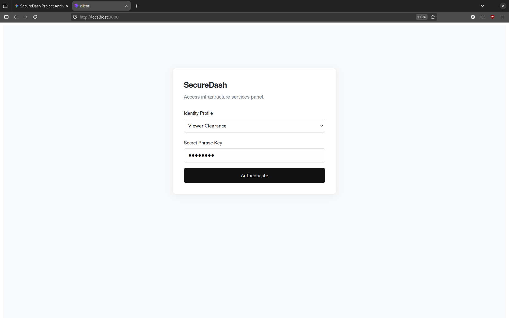
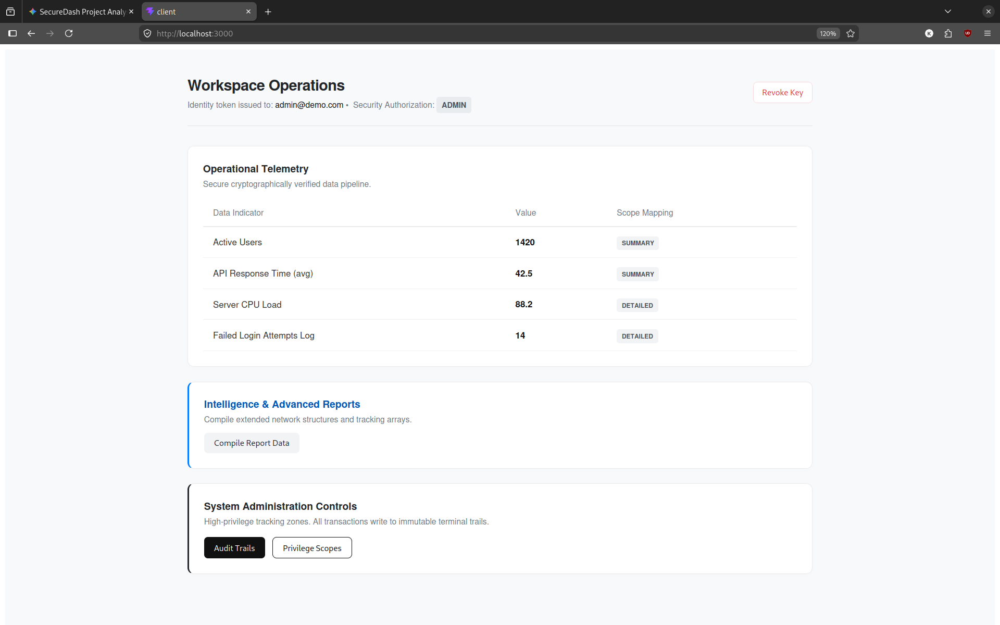

# SecureDash 🔐

A high-performance, minimal full-stack dashboard demonstrating robust **Role-Based Access Control (RBAC)** across the MERN stack. Built with security-first engineering principles, it utilizes stateless cryptographic session validation to prevent privilege escalation attacks even in compromised client-side environments.

---

## 🖼️ Interface Preview

### Secure Access Gateway
<p align="center">
  
</p>

### Executive Operational View Workspace
<p align="center">
  
</p>

---

## 🚀 Key Features

* **Minimalist Premium UI/UX:** Styled using modern monochrome design architectures, high-contrast layouts, clean rule grids, and responsive interactive states.
* **Cryptographic Authorization:** Multi-tiered user authentication powered by cryptographically signed JSON Web Tokens (JWT).
* **Authoritative Server Boundary:** Total decoupling of data layer from presentation layer. Tampering with client state variables will not leak database records.
* **Resilient State Management:** Pure-functional component mapping with asynchronous race-condition defenses and clean React Hook separation.
* **Vite Hot Module Optimization:** Cleanly structured utility scopes eliminating HMR reload invalidation loops.

---

## 🛠️ Tech Architecture

| Layer | Technology Stack | Purpose |
| :--- | :--- | :--- |
| **Frontend** | React, Vite, Axios | Stateless Client Interface, Component Gating |
| **Backend** | Node.js, Express | Security Middleware, Authorization, JWT Verification |
| **Security** | JSON Web Tokens (`jsonwebtoken`) | Immutable Cryptographic Claims Verification |

---

## 🔒 Security Matrix & Clearance Tiers

The application enforces data query boundaries at the database routing level using decoded payload scopes:

---

[Client Browser]                                         [Express Backend]
Local Storage Tampering

│                                                              │
│ ─── GET /api/metrics (with original signed JWT) ───────────> │
│                                                              │ ──> Verify Cryptographic Signature
│                                                              │ ──> Payload Claim Evaluated
│                                                              │ ──> Formulates Strict Database Query
│ <── Returns Authorized Scope Data Records Only ────────────── │


* **Root Administrator (`Admin`):** Full execution space visibility. Grants read/write access to system logs, audit trails, and data schema updates.
* **Analyst Clearance (`Analyst`):** Intermediate visibility. Accesses advanced reporting structures, technical data compilations, and summary data maps.
* **Viewer Clearance (`Viewer`):** Read-only summary metrics baseline. Completely restricted from structural administration views or raw data pipelines.

---

## 📦 Project Directory Structure

```text
SecureDash/
├── client/                 # Frontend React Application
│   ├── src/
│   │   ├── components/     # RoleGuard conditional rendering wraps
│   │   ├── hooks/          # Isolated Auth Contexts and custom hook utilities
│   │   ├── App.jsx         # Premium minimalist dashboard layout canvas
│   │   └── main.jsx
│   └── .env                # Client configuration (Vite prefixed variables)
└── server/                 # Backend REST API Server
    ├── routes/             # Authentication & Metrics controller paths
    ├── app.js              # Express app core routing & global CORS filters
    └── .env                # High-entropy server verification parameters